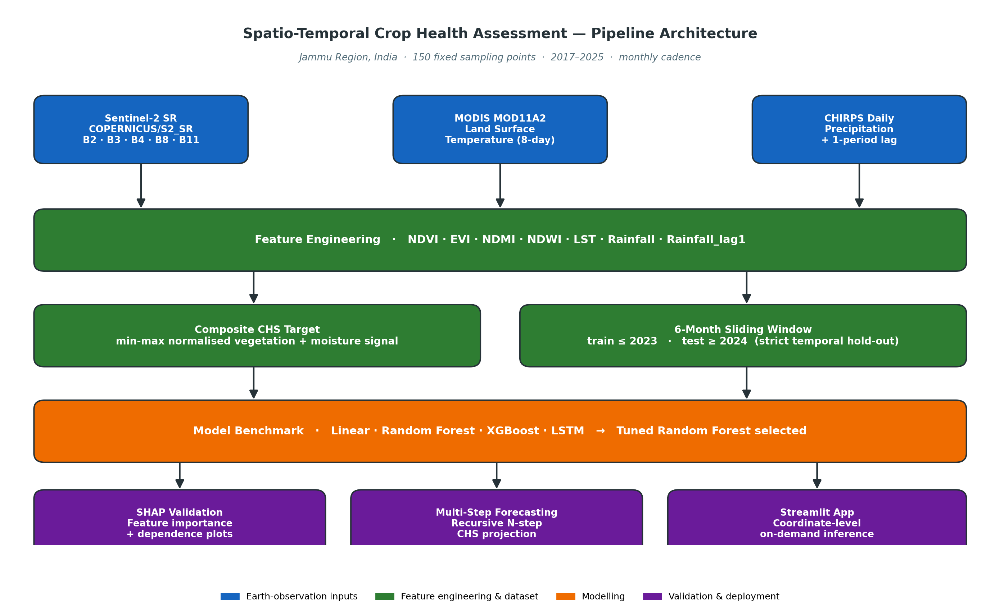
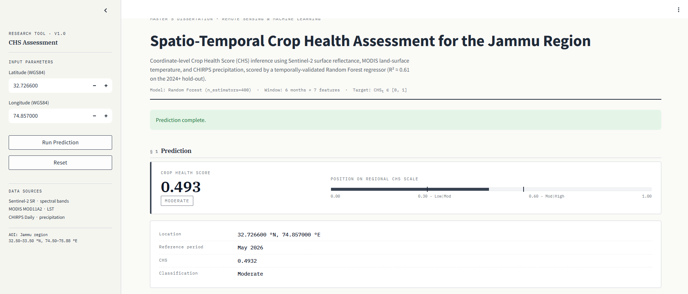

<h1 align="center">🌾 Spatio-Temporal Crop Health Assessment for the Jammu Region</h1>

<p align="center">
  <em>A satellite-driven, machine-learning pipeline for monitoring and forecasting crop health in Jammu &amp; Kashmir, India.</em>
</p>

<p align="center">
  
  
  
  
  
  <a href="https://doi.org/10.5281/zenodo.20259081"></a>
</p>

<p align="center">
  
</p>
<p align="center">
     
</p>
---

## 📖 Overview

This repository contains the complete research pipeline and deployment code for a dissertation project on **spatio-temporal crop health assessment using remote sensing and machine learning** in the Jammu region of India. The workflow ingests multi-source satellite data through the Google Earth Engine (GEE) API, derives vegetation and hydro-climatic indices over 150 fixed sampling points, models a continuous **Crop Health Score (CHS)** with classical and deep-learning regressors, validates the best model with interpretability tooling, performs recursive multi-step forecasting, and exposes the trained model through an interactive Streamlit application that accepts any user-supplied coordinate.

The project is intended both as a reproducible scientific artefact for examiners and as a starting point for downstream agricultural decision-support tools.

## 🧭 Study Area &amp; Data

The study area covers the agricultural landscape of the **Jammu region** in the Union Territory of Jammu &amp; Kashmir. One hundred and fifty fixed spatial sampling points were generated across the region and tracked monthly from 2017 to 2025. Three open satellite archives are used: Sentinel-2 surface reflectance (`COPERNICUS/S2_SR`) for optical bands, MODIS `MOD11A2` for daytime land-surface temperature, and CHIRPS daily precipitation for rainfall and a one-period lag.

From these sources the pipeline derives seven predictive features — **NDVI, EVI, NDMI, NDWI, LST, Rainfall, and Rainfall_lag1** — and a composite **CHS** target that normalises crop vigour onto a 0–1 scale.

## 🏗️ Pipeline Architecture

The end-to-end workflow is split into six numbered notebooks under [`notebooks/`](./notebooks), each corresponding to one stage of the dissertation:

| Stage | Notebook | Purpose |
|-------|----------|---------|
| 1 | `01_data_extraction.ipynb` | Authenticates GEE, defines the Jammu AOI and 150 sampling points, and exports monthly Sentinel-2, MODIS, and CHIRPS features. |
| 2 | `02_preprocessing_pca.ipynb` | Cleans the long-format feature table, engineers the rainfall lag, builds the CHS target, and runs PCA for exploratory variance analysis. |
| 3 | `03_model_building.ipynb` | Builds 6-month sequence windows and benchmarks Linear Regression, Random Forest, XGBoost, and an LSTM regressor on a temporal hold-out. |
| 4 | `04_validation_shap.ipynb` | Re-loads the winning model, computes metrics on the 2024+ test set, and produces SHAP-based interpretability plots. |
| 5 | `05_multi_step_forecasting.ipynb` | Implements recursive *N*-step forecasting on top of the trained model for forward-looking CHS projection. |
| 6 | `06_coordinate_prediction.ipynb` | Demonstrates a single-coordinate prediction workflow that wraps GEE feature extraction around the saved model — the prototype that became the Streamlit app. |

The flow can be summarised as: **GEE feature extraction → preprocessing &amp; CHS construction → model benchmarking → temporal validation &amp; SHAP → multi-step forecasting → coordinate-level inference → web app.**

## 📈 Results

All models were trained on observations up to and including 2023 and evaluated on a held-out test set spanning 2024 onwards. Sequences are six-month sliding windows of the seven features, flattened to a 42-dimensional vector for the classical learners and kept as a `(6, 7)` tensor for the LSTM. Metrics are reported on the unscaled CHS target in its native 0–1 range.

| Model | R² | RMSE | MAE |
|---|---:|---:|---:|
| Linear Regression | 0.589 | 0.1033 | 0.0739 |
| Random Forest (default) | 0.599 | 0.1020 | 0.0741 |
| XGBoost | 0.579 | 0.1045 | 0.0753 |
| LSTM (64 units, dropout 0.2) | 0.476 | 0.1167 | 0.0862 |
| **Random Forest (tuned)** ⭐ | **0.608** | **0.1009** | **0.0723** |

The tuned Random Forest was retained as the production model and is serialised as `Best_model.pkl`. On the same temporal hold-out, its **Pearson correlation between predicted and observed CHS is 0.78**.

Recursive multi-step forecasting was then evaluated on the same hold-out by feeding each prediction back into the input window. The one-step horizon retains the in-sample accuracy, but error accumulates rapidly thereafter — an honest baseline that motivates the future-work direction discussed in `docs/METHODOLOGY.md`.

| Horizon | RMSE | MAE | R² |
|---:|---:|---:|---:|
| t + 1 | 0.1018 | 0.0740 | 0.599 |
| t + 2 | 0.1841 | 0.1374 | −0.312 |
| t + 3 | 0.2166 | 0.1764 | −0.797 |

SHAP analysis on the tuned Random Forest places NDVI and NDMI as the dominant contributors to predicted CHS, with LST and Rainfall_lag1 acting as significant secondary modifiers — a result that is consistent with the agronomic literature for the region.

## 🖥️ Streamlit Application

The deployed application in [`app/app.py`](./app/app.py) lets a user pick any latitude/longitude in the study area — either by typing coordinates or by clicking on a Folium map — choose a target month and year, and run on-demand prediction. The app pulls a small 500 m buffer of Sentinel-2, MODIS, and CHIRPS imagery for the requested period, computes the seven indices server-side, scores them with the saved Random Forest, and renders a coloured marker (**Low / Moderate / High**) on the map alongside a results table.

To launch it locally:

```bash
streamlit run app/app.py
```

A live deployment can be hosted on [Streamlit Community Cloud](https://streamlit.io/cloud) or [Hugging Face Spaces](https://huggingface.co/spaces) with no code changes.

## 🚀 Quickstart

```bash
# 1. Clone
git clone https://github.com/DivyamVerma22/crop-health-jammu.git
cd crop-health-jammu

# 2. Create an isolated environment
python -m venv .venv && source .venv/bin/activate   # Windows: .venv\Scripts\activate

# 3. Install dependencies
pip install -r requirements.txt

# 4. Authenticate Google Earth Engine (one-time, see docs/SETUP.md)
earthengine authenticate

# 5. Download the trained model weights
python scripts/download_model.py

# 6. Launch the app
streamlit run app/app.py
```

To re-run the research notebooks, open them with Jupyter Lab or in Google Colab. Setup details, including the GEE project-name override, are documented in [`docs/SETUP.md`](./docs/SETUP.md).

## 📂 Repository Layout

```
crop-health-jammu/
├── app/                       # Streamlit production application
│   └── app.py
├── notebooks/                 # Numbered research notebooks (stages 1–6)
├── data/sample/               # Small CSV samples for reproduction
├── models/                    # Trained model artefacts (downloaded, see scripts/)
├── scripts/                   # Helper scripts (model download, env checks)
├── docs/                      # Methodology, setup, and Zenodo guide
├── reports/figures/           # Architecture diagram and dissertation figures
├── requirements.txt
├── CITATION.cff
├── LICENSE
└── README.md
```

## 📦 Data &amp; Model Weights

Only **lightweight sample CSVs** are committed under [`data/sample/`](./data/sample) so the repository stays small and clone-friendly. The full Sentinel-2 / MODIS / CHIRPS feature table can be regenerated from `notebooks/01_data_extraction.ipynb` once Earth Engine access is configured.

The trained model file (`Best_model.pkl`, 228 MB) is **not** stored directly in Git. Two supported retrieval options are documented in [`docs/SETUP.md`](./docs/SETUP.md): pulling it through Git LFS, or fetching it from an external host (Hugging Face Hub, Zenodo, or Google Drive) using the provided helper script. The recommended path — and the one that produces a citeable DOI — is described in [`docs/ZENODO.md`](./docs/ZENODO.md).

## 📊 Reproducibility

Every notebook fixes the random seed where applicable, all temporal splits are deterministic (≤ 2023 train, ≥ 2024 test), and exact package versions are pinned in `requirements.txt`. The full methodology — feature definitions, sequence construction, evaluation protocol, and SHAP analysis — is described in [`docs/METHODOLOGY.md`](./docs/METHODOLOGY.md).

## 📜 Citation

If you use this code or methodology in academic work, please cite the dissertation via the metadata in [`CITATION.cff`](./CITATION.cff). GitHub renders this as a one-click *"Cite this repository"* button. Once a Zenodo DOI has been minted, the badge at the top of this README will resolve to the archived, version-pinned record.

## ⚖️ License

This project is released under the [MIT License](./LICENSE). The Sentinel-2, MODIS, and CHIRPS datasets retain their respective providers' licensing terms.

## 🙏 Acknowledgements

This work was carried out as part of a master's dissertation in the Jammu &amp; Kashmir region. It builds upon the Google Earth Engine platform, the open Sentinel-2 mission (Copernicus / ESA), NASA MODIS, and the UCSB CHIRPS climate record. Sincere thanks to the dissertation supervisors and reviewers for their guidance.

---

<p align="center"><em>For questions, issues, or collaboration enquiries, please open a GitHub issue.</em></p>
